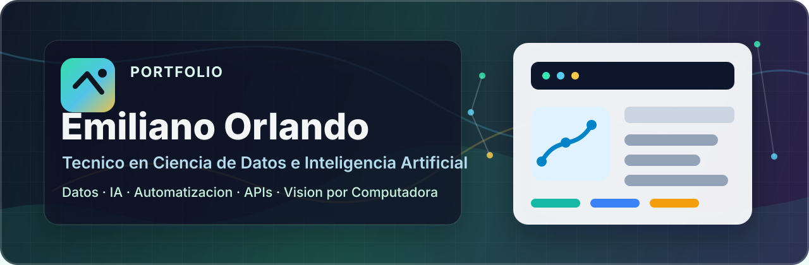

# Hola, soy Emiliano Orlando

### Técnico en Ciencia de Datos e Inteligencia Artificial

Trabajo con Python, SQL, automatización, APIs, modelos de IA y herramientas de visión por computadora. Me gusta armar proyectos completos: desde la exploración de datos y el diseño del pipeline hasta la documentación, las métricas y una demo que se pueda usar.

En mis repos vas a encontrar proyectos de Ciencia de Datos, Machine Learning, Computer Vision, automatización con IA, procesamiento de información e investigación aplicada.

---

## Qué sé hacer

- Programación en Python para análisis, automatización y prototipos de IA.
- Consultas y modelado básico con SQL.
- Procesamiento de datos, estructuración de pipelines y documentación reproducible.
- Machine Learning y Deep Learning aplicado con PyTorch, NumPy, SciPy y herramientas relacionadas.
- Visión por computadora con YOLOv8, OpenCV, embeddings, tracking y búsqueda vectorial con FAISS.
- Automatización de flujos con n8n, JavaScript, APIs, OAuth2 y modelos LLM como Gemini.
- Integración de herramientas experimentales como Qiskit e IBM Quantum Runtime para investigación híbrida.
- Armado de reportes, evidencias técnicas, README completos y proyectos presentables.

---

## Proyectos destacados

### CowTrack MVP - Detección, conteo, tracking y Re-ID de vacas

Sistema completo para analizar video aéreo real de ganado mediante YOLOv8, embeddings Re-ID, FAISS y tracking temporal.

- Detección y conteo de vacas en video capturado con dron.
- Reidentificación individual de vacas catalogadas.
- Pipeline end-to-end con render final, reportes, métricas y webapp local.
- Validación funcional del caso Erondina: 13 vacas reales vs 13 estimadas por el pipeline.
- Stack principal: Python, PyTorch, YOLOv8, OpenCV, FAISS, NumPy, SciPy.

Repo: [cow-tracker-mvp](https://github.com/emilianorlando-collab/cow-tracker-mvp)

---

### CowTrack - Pipeline Re-ID con embeddings y FAISS

Proyecto de investigación y desarrollo para identificación individual de vacas por apariencia visual.

- Entrenamiento de embeddings con ResNet18 y triplet loss.
- Indexación vectorial rápida con FAISS.
- Evaluación closed-set y open-set sobre OpenCows2020.
- Calibración de thresholds para rechazar individuos desconocidos.
- Base técnica para evolucionar hacia detección, tracking y Re-ID en condiciones reales de campo.

Repo: [cowtrack](https://github.com/emilianorlando-collab/cowtrack)

---

### AutoNews - Pipeline automatizado de noticias con IA

Flujo self-hosted para extraer, procesar, resumir y distribuir noticias de tecnología y ciencia.

- Ingesta de feeds RSS mediante n8n.
- Normalización de datos con JavaScript.
- Síntesis semántica con Google Gemini.
- Distribución del reporte final por Gmail API con OAuth2.
- Documentación técnica, arquitectura del flujo y evidencias visuales.

Repo: [AutoNews](https://github.com/emilianorlando-collab/AutoNews)

---

### Dorabella Quantum Decoder - Criptoanálisis híbrido clásico/cuántico

Framework experimental para investigar el cifrado Dorabella con restricciones simbólicas, búsqueda léxica, memoria persistente y ejecución opcional con Qiskit / IBM Quantum Runtime.

- Motor de restricciones con bijección estricta y alfabetos rotativos.
- Búsqueda léxica y scoring semántico de candidatos.
- Integración con Qiskit Aer e IBM Quantum Runtime para muestreo híbrido.
- Separación entre hipótesis privadas, evidencia generada y código reproducible.
- Stack principal: Python, Qiskit, NumPy, IBM Quantum Runtime.

Repo: [dorabella_quantum_decoder](https://github.com/emilianorlando-collab/dorabella_quantum_decoder)

---

### Portfolio

Repositorio base para organizar y publicar mi portfolio profesional de proyectos de Ciencia de Datos e Inteligencia Artificial.

Repo: [portfolio](https://github.com/emilianorlando-collab/portfolio)

---

## Tech Stack

### Lenguajes

### Datos, IA y visión por computadora

### Automatización, APIs y herramientas

---

## Foco actual

- Consolidar un portfolio sólido de proyectos end-to-end en Ciencia de Datos e IA.
- Mejorar pipelines reproducibles con métricas, reportes y documentación profesional.
- Seguir desarrollando proyectos aplicados con datos, modelos, automatización e interfaces utilizables.
- Explorar automatizaciones con LLMs, integraciones API y agentes de IA.
- Llevar prototipos de laboratorio a sistemas demostrables y fáciles de explicar.

---

## Contacto

Email: emilianorlando@gmail.com  
LinkedIn: [linkedin.com/in/emiliano-orlando-13405758](https://www.linkedin.com/in/emiliano-orlando-13405758/)

---

Gracias por visitar mi perfil. Podés recorrer mis repositorios para ver proyectos de Ciencia de Datos, automatización, visión por computadora e investigación aplicada con IA.
